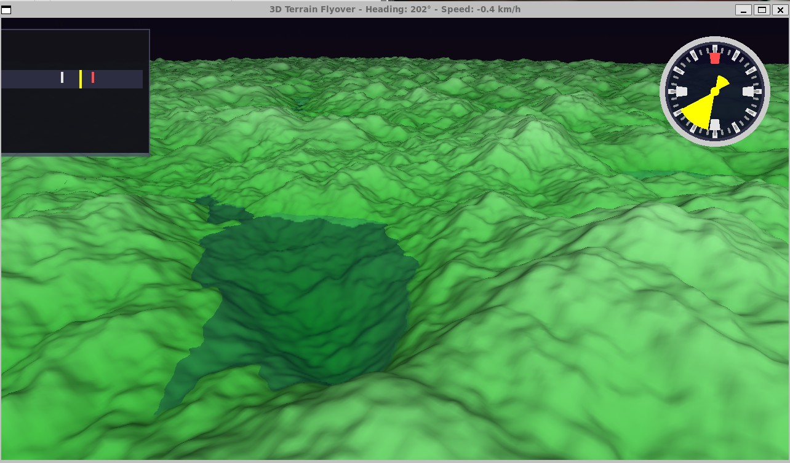

# 3D Terrain Flyover

A comprehensive C++23 flight simulator featuring infinite procedural terrain, realistic Melbourne night sky with astronomically accurate stars, and professional aviation instrumentation. Experience seamless flight over dynamically generated landscapes with atmospheric fog effects and smooth performance.

## Demo



## 🌟 Key Features

### 🗺️ Infinite Terrain System
- **Dynamic Chunk Loading** - Seamless infinite world with 32-chunk view distance
- **4-Level LOD System** - Optimized performance with distance-based detail reduction
- **Edge Stitching** - Smooth transitions between terrain blocks without gaps
- **4 Distinct Biomes** with realistic transitions:
  - 🏜️ **Desert** - Rolling sand dunes with warm orange-yellow gradients
  - 🌲 **Forest** - Lush green hills with varied elevation
  - 🏔️ **Mountains** - Towering peaks with snow-capped summits
  - ❄️ **Tundra** - Icy plains with blue-white permafrost coloring
- **Multi-Scale Perlin Noise** - Continental, regional, and local detail layers

### 🌌 Melbourne Night Sky
- **Astronomically Accurate** - Real star positions and magnitudes for Melbourne, Australia (-37.8° S)
- **25+ Major Stars** - Including Sirius, Canopus, Alpha Centauri, and the iconic Southern Cross
- **Realistic Effects**:
  - Magnitude-based star sizing (brighter stars appear larger)
  - Atmospheric scintillation (twinkling effects)
  - Diffraction spikes for bright stars
  - Background star field using procedural noise
- **Dynamic Atmosphere** - Stars fade naturally based on sky brightness

### ✈️ Professional Flight Controls
- **Full 3D Movement** - Pitch, yaw, and velocity-based flight physics
- **Aviation Instrumentation**:
  - Graphical compass with cardinal directions
  - Real-time heading indicator (0-360°)
  - Speed display in km/h
  - Altitude management above terrain
- **Realistic Physics**:
  - Acceleration/deceleration with air resistance
  - Speed-dependent turn rates
  - Automatic terrain collision avoidance

### 🌊 Advanced Water Rendering
- **Realistic Water Surface** - Reflections, refractions, and wave simulation
- **Dynamic Effects** - Moving water with specular highlights
- **Enhanced Opacity** - Improved visibility and depth perception

### 🌫️ Atmospheric Effects
- **Exponential Distance Fog** - Smooth blending from terrain to skybox
- **Skybox Integration** - Fog color matches Melbourne night sky
- **Enhanced Depth Perception** - Improved sense of scale in infinite terrain

## Building

### Prerequisites
```bash
# Ubuntu/Debian/WSL
sudo apt-get update
sudo apt-get install -y \
    build-essential cmake \
    libsdl2-dev libglew-dev \
    libboost-all-dev libglm-dev \
    libgtest-dev
```

### Build Steps
```bash
./build.sh
```

Or manually:
```bash
mkdir build && cd build
cmake .. -DCMAKE_BUILD_TYPE=Release
make -j$(nproc)
```

## 🎮 Controls

| Key/Input | Action |
|-----------|--------|
| **W** | Accelerate forward |
| **S** | Decelerate / Reverse |
| **A** | Turn left |
| **D** | Turn right |
| **Z** | Pitch up (climb) |
| **X** | Pitch down (dive) |
| **ESC** | Exit |

### 🧭 Navigation Instruments
- **Compass** - Circular compass in top-right corner with cardinal directions
- **Heading Display** - Numerical heading (0-360°) in window title
- **Speed Indicator** - Current speed in km/h displayed in window title
- **Altitude Management** - Automatic terrain following prevents underground flight

## 📊 Performance & Optimization

**Target Performance**: 60+ FPS on RTX 2070 class hardware

### Performance Features
- **Dynamic LOD System** - 4 levels of detail reduce polygon count for distant terrain
- **Frustum Culling** - Only render visible terrain chunks (distance-based culling for stability)
- **Chunk Pooling** - Memory reuse prevents allocation overhead during flight
- **Efficient Shaders** - Optimized GLSL with minimal branching
- **Fog Optimization** - Exponential fog more efficient than linear variants

### Memory Usage
- **~200MB RAM** for 32-chunk view distance
- **Chunk Size** - 64x64 units with 65x65 vertex resolution
- **Pool Management** - 200 pre-allocated chunks for smooth loading

### Graphics Settings
- **Shadow Resolution** - 1024x1024 shadow maps with PCF soft shadows
- **Water Reflections** - Half-resolution reflections for performance balance
- **Fog Distance** - Starts at 500m with exponential falloff
- **View Distance** - 32 chunks (2048 units) maximum render distance

## 🧪 Testing

### Unit Tests
```bash
cd build
ctest                    # Run all tests
./test_perlin           # Test noise generation
./test_camera           # Test camera controls  
./test_biome            # Test biome system
```

### Test Coverage
- ✅ **Perlin Noise** - Deterministic generation, range validation
- ✅ **Camera System** - Movement, rotation, matrix calculations
- ✅ **Biome Generation** - Height calculation, color interpolation
- ❌ **Graphics Pipeline** - Requires manual testing (no headless OpenGL)

## 🔧 Technical Architecture

### Core Technologies
- **Language**: C++23 with modern features
- **Graphics API**: OpenGL 3.3 Core Profile
- **Mathematics**: GLM for vectors, matrices, and transformations
- **Window Management**: SDL2 for cross-platform compatibility
- **Configuration**: JSON-based external configuration system

### System Architecture
```
Application (Main.cpp)
├── Camera System (3D flight controls)
├── Dynamic Terrain (infinite chunk management)
│   ├── Terrain Chunks (individual mesh generation)
│   ├── Biome System (procedural landscape variety)
│   └── Perlin Noise (multi-octave terrain generation)
├── Water Rendering (reflections, refractions, waves)
├── Skybox System (Melbourne night sky with stars)
├── HUD System (compass, heading, speed indicators)
└── Shader Management (GLSL compilation and uniforms)
```

### Design Patterns
- **RAII** - Automatic OpenGL resource management
- **Component System** - Modular, loosely-coupled architecture
- **Configuration-Driven** - External JSON for all parameters
- **Smart Pointers** - Modern C++ memory management with std::unique_ptr

## 🌍 Platform Support

**Tested Platforms**:
- ✅ **Windows 11 WSL2** - Primary development environment
- ✅ **Ubuntu 22.04+** - Native Linux support
- ⚠️ **Windows Native** - Should work but not extensively tested
- ⚠️ **macOS** - OpenGL 3.3 support required

## License

MIT License - see [LICENSE](LICENSE) file for details.
